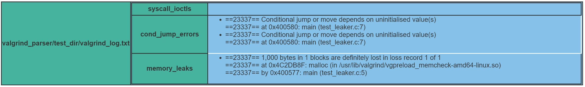

[](https://travis-ci.com/siddheshsathe/Valgrind-Log-Parser)
# Valgrind Parser Tool
---
This tool helps to parse the valgrind logs generated by a [valgrind](http://valgrind.org/) tool.

## Pre-requisites
The only package needed for successful run of `valgrind_log_parser.py` is mentioned in `requirements.txt`. <br>
Use pip to install these requirements.
```bash
pip install -r requriements.txt
```
## Pip install
One can install valgrind parser tool from pip as well.
```bash
pip install valgrind_parser
```
Import the package as
```python
>>> from valgrind_parser import ValgrindLogParser
>>> vlp = ValgrindLogParser('/path/to/valgrind_logs.txt')
>>> vlp.generate_html_report()
```
This will dump the html report for input `valgrind_logs.txt` in the same directory from where the program was called.

## Cloning the repo
`Valgrind-Log-Parser` can also be used by cloning the repo locally and using the python file directly.
Clone the repo with below command and use as given in next sections.
```bash
git clone git@github.com:<your username>/Valgrind-Log-Parser.git
```

## How to use
Under test_leaker directory, `test_leaker.c` file is present. This file is having a memory leak and a condition check with a variable which is not initialized before. <br>
When run with valgrind, the valgrind report should highlight these two things.
```c
#include<stdio.h>
#include<stdlib.h>

int main(){
    int *memory_allocation_var = malloc(1000); // Leaked memory which is never freed
    int conditional_jump_variable_without_initialize;
    if (conditional_jump_variable_without_initialize > 0){ // Variable used without initialization
        printf("Variable not initialized still using here \n");
    }
    return 0;
}
```

### Compile C file
To compile c file on Linux environment, one must use `gcc` with `-g` option which enables debug symbols from the binary.
```bash
gcc -g test_leaker.c -o test_leaker
```
Post successful compilation, install valgrind from its official source mentioned at [valgrind_website](http://valgrind.org/) and execute with our `test_leaker` binary.
```bash
valgrind -v --leak-check=full --show-reachable=yes --log-file=valgrind_log.txt ./test_leaker
```
This will dump the valgrind logs in `valgrind_log.txt`

### Using `valgrind_log_parser.py`
The `--help` argument can help to understand how to use this parser.
```bash
python valgrind_log_parser.py --help
usage: valgrind_log_parser.py [-h] --valgrind_file VALGRIND_FILE

optional arguments:
  -h, --help            show this help message and exit
  --valgrind_file VALGRIND_FILE
                        Provide the path of the valgrind file. Files must be
                        of .txt format
```
Provide `valgrind_log.txt` file in argument to `valgrind_log_parser.py` and it will create a HTML report out of it in the same directory.
```bash
python valgrind_log_parser.py --valgrind_file <path to valgrind_log.txt file>
```
Following table will be generated with the above run.

